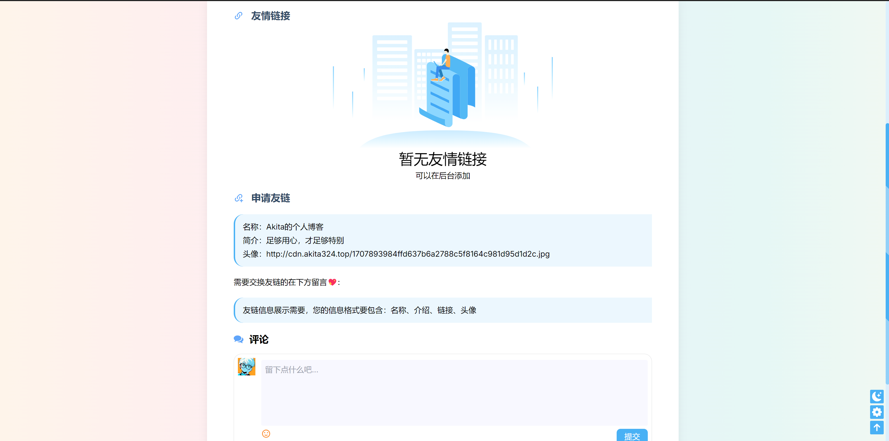
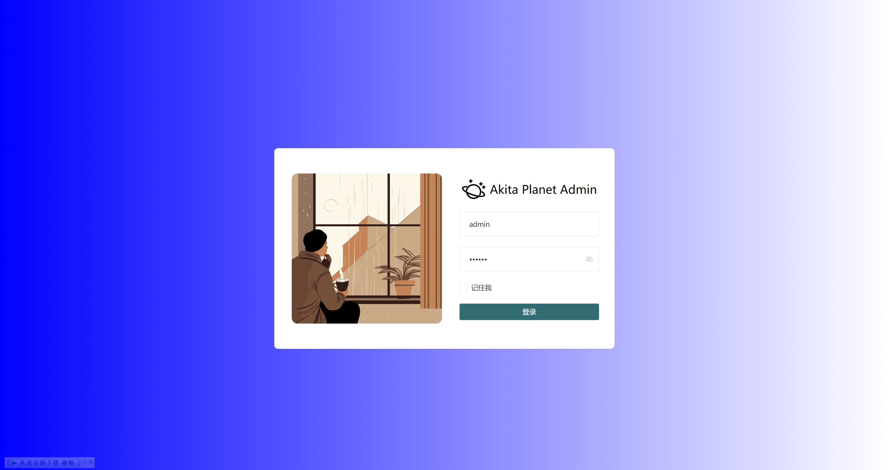
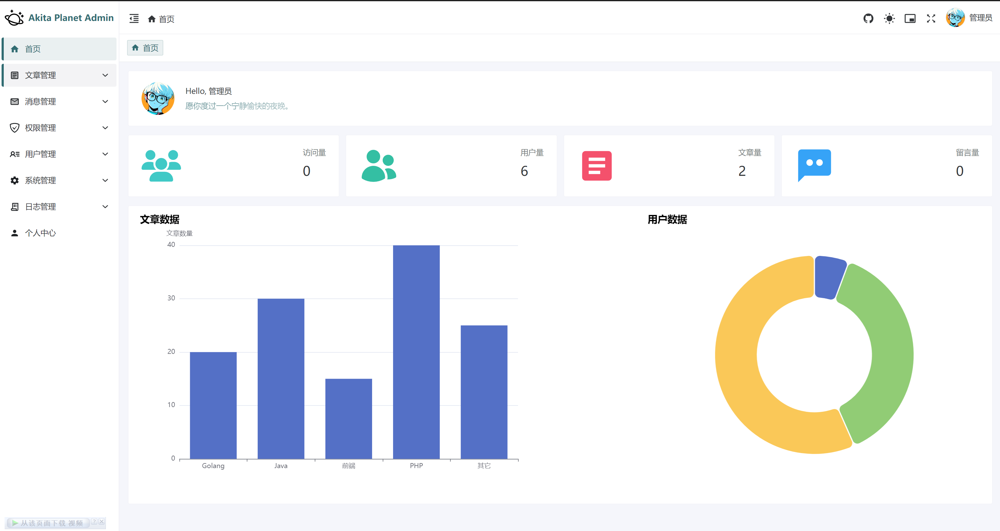
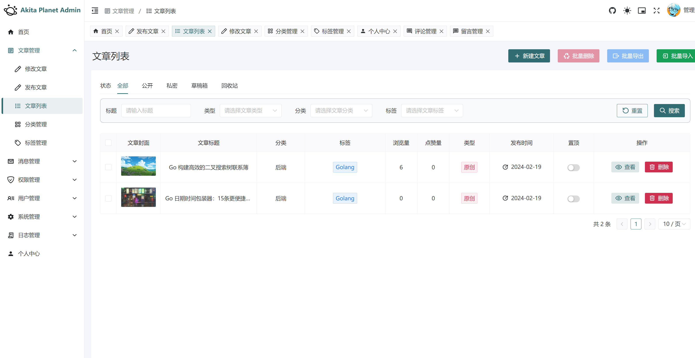
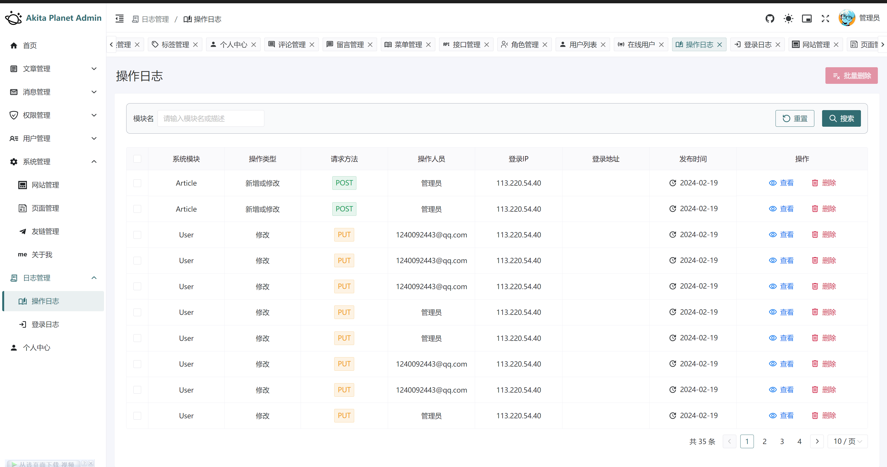
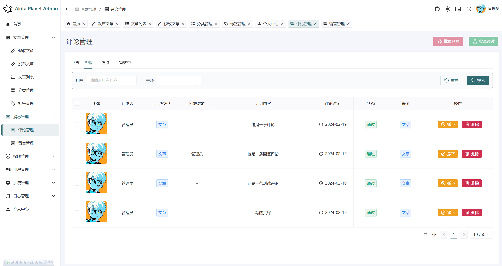
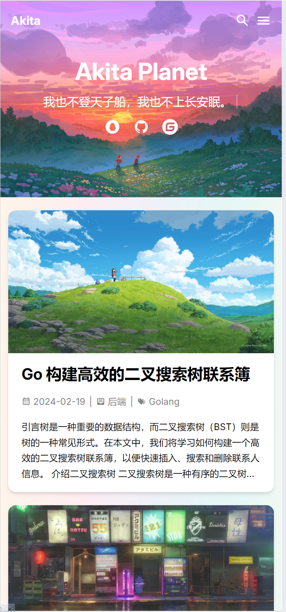
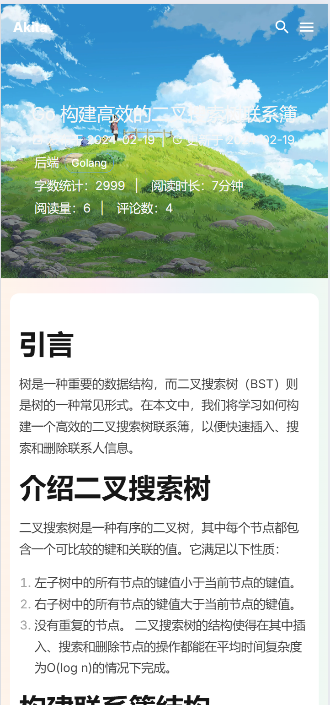

##  👨‍💻 项目作者：


<div align="center">
  <a href="http://www.akita324.top">
    
  </a>
</div>

# <div align="center">Hello, I'm Akita!</div>
## <div align="center">A tech enthusiast and a passionate programmer</div>

## 💻 项目介绍：

> AkitaPlanet是一款极具创新性和前瞻性的全栈应用，旨在为用户提供无与伦比的在线体验。这个项目集成了最新、最先进的前端和后端技术，结合了强大的云服务和安全验证机制，为用户打造了一个安全、稳定、高效的全方位服务平台。

### 前端技术栈：
在前端方面，我采用了 📦 pnpm 作为包管理工具，借助 📘 TypeScript 构建了可靠的前端应用。我选择了 ⚡ Vue3 作为前端框架，结合 🛠️ VueUse 和 Vue Composition API，实现了高效的组件开发和数据管理。为了更好地管理样式和提高页面加载速度，我引入了 🎨 Unocss 来实现原子化 CSS，使得样式的维护和调整变得更加便捷。Pinia 提供了可靠的状态管理，Vue Router 则负责实现页面导航，而 🚀 Axios 负责处理前后端的数据交互。为了打造出色的用户界面，我选择了 🎨 Naive UI 作为组件库，提供了丰富、美观的UI组件，让用户体验更加流畅和愉悦。

### 后端技术栈：
AkitaPlanet 这个项目采用了最先进的技术栈，旨在为用户提供卓越的博客阅读体验。借助 🚀 Golang 这门高性能的编程语言，我打造了一个高效、可靠的后端服务。

在项目中，我充分利用了 📦 Gin 框架和 GORM ORM 框架的强大功能，结合 🐳 Docker 容器化技术，实现了业务逻辑的模块化和快速部署。使用 🚀 Viper 框架，我可以灵活地管理项目配置，随时调整系统参数，确保系统运行的高度灵活性和可配置性。

为了保障系统的安全性和权限管理，我引入了 🔒 Casbin 权限管理框架，有效地控制了用户的访问权限。同时，利用 📝 Zap 日志库，我实现了对系统运行情况的实时监控和记录，为系统的稳定运行提供了可靠的保障。

作为后端数据存储和缓存的关键组件，我选择了 🗃️ MySQL 和 🔄 Redis 数据库。MySQL 提供了数据持久化存储的支持，而 Redis 则用于缓存系统的热点数据，进一步提升了系统的访问速度和响应性能。

最后，为了优化前端资源的访问和加速网站加载速度，我利用 🚀 Nginx 服务器部署了静态资源，并实现了反向代理，极大地提升了用户的访问体验。

### 其他技术和服务：
除了前后端技术栈，我还集成了 🛡️ 腾讯云人机验证、📦 七牛云对象存储 和 📧 腾讯邮箱 等服务，为用户提供更全面的功能和更好的用户体验。通过这些技术和服务的整合，我将开发出一个高度现代化、安全可靠的全栈应用，为用户带来前所未有的在线体验和服务。

<p align="center">
  <a target="_blank" href="#">
    
    
    
    
    
    
    <br>
    
    
    
    
    
    
    
    
  </a>
</p>


## 🔍 在线预览：

### 链接信息：

| 名称       | 链接                                                                                       | 备注             |
|----------|------------------------------------------------------------------------------------------|----------------|
| 在线接口文档地址 | [AkitaPlanet-api](https://apifox.com/apidoc/shared-af22a508-fb18-4c9a-9fc0-32688bcbd277) | 后续准备换成 Swagger |
| 博客前台链接   | [http://www.akita324.top](http://www.akita324.top)                                       | 已适配移动端         |
| 博客后台链接   | [http://www.akita324.top:81](http://www.akita324.top:81)                                 | 暂未专门适配移动端      |

### 账号和密码：

| 类型      | 账号          | 密码     | 可用范围         |
|---------|-------------|--------|--------------|
| 测试账号    | test@qq.com | 11111  | 前后台都可用这个账号登录 |
| admin账号 | admin       | 123456 | 前后台都可用这个账号登录 |


## 💡 项目特点：

### 前台：

> 采用了 Hexo 的 Butterfly 设计理念，使界面呈现出美观简洁的风格，为用户提供愉悦的浏览体验。
响应式布局技术被精心应用，确保了在不同设备上的流畅展示，无论是在PC端还是移动端，用户都能够得到良好的视觉呈现。
实现了点赞和用户统计等功能，利用了 Redis 数据库，极大地提升了用户互动性和体验度。
引入了评论和回复评论功能，为用户提供了交流和互动的平台，增强了用户参与感和社区氛围。
采用了炫酷的弹幕墙设计，为用户留言提供了一种新颖有趣的形式，让用户感受到与众不同的互动体验。
文章详情页不仅提供了文章目录和推荐文章等功能，还通过优化用户体验，使用户在阅读过程中能够更加便捷地获取信息和导航。

### 后台：

> 鉴权机制采用了 JWT 技术，确保了系统的安全性和用户身份的合法性，为用户数据和系统资源提供了有效的保护。
权限管理借助 CASBIN 实现了基于 RBAC 的精细化权限控制，使得对用户权限的管理更加灵活和精准。
实现了动态权限修改功能，使得权限管理更加灵活，同时前端菜单由后端生成，保证了菜单与权限的一致性和安全性。
文章编辑器采用 Markdown 编辑器，简洁高效，为用户提供了便捷的文章编辑体验。
后台功能齐全，包括侧边栏、面包屑、标签栏等，使得用户在后台管理过程中能够更加方便地进行操作和导航。
记录操作日志功能的实现增强了系统的安全性和监控性，对用户操作进行实时记录和追踪，提高了系统的可追溯性。
实现了在线用户监听和强制下线功能，保障了系统的安全性和稳定性，及时发现并处理异常登录情况。
文件上传支持七牛云和本地存储，提供了灵活的文件管理和存储方式，满足了不同用户的需求。
对 CRUD 操作进行了通用 Hook 封装，提高了代码的复用性和可维护性。 

### 其他：
> 采用了 Restful 风格的 API 设计，提供了统一规范的接口调用方式，使得前后端交互更加简洁和高效。
前后端分离部署，利用 Nginx 和 Docker 技术，实现了系统的高可用性和可扩展性，同时提供了简便的部署和管理方式。
代码整洁层次清晰，采用了新颖的技术点和轻量级的代码结构，为开发者提供了学习和交流的优秀范本。
Docker Compose 提供了一键运行的部署方案，使得搭建在线博客变得轻松快捷，为用户提供了更加便利的服务

## 🧱 项目结构：

```
AkitaPlanet-server
├── api             -- API
│   ├── front       -- 前台接口
│   └── v1          -- 后台接口
├── dao             -- 数据库操作模块
├── service         -- 服务模块
├── model           -- 数据模型
│   ├── req             -- 请求 VO 模型
│   ├── resp            -- 响应 VO 模型
│   ├── dto             -- 内部传输 DTO 模型
│   └── ...             -- 数据库模型对象 PO 模型
├── routes          -- 路由模块
│   └── middleware      -- 路由中间件
├── utils           -- 工具模块
│   ├── r               -- 响应封装
│   ├── upload          -- 文件上传
│   └── ...
├── routes          -- 路由模块
├── config          -- 配置文件
├── test            -- 测试模块
├── assets          -- 资源文件
├── log             -- 存放日志的目录
├── public          -- 外部访问的静态资源
│   └── uploaded    -- 本地文件上传目录
├── Dockerfile
└── main.gore  

#### 前端目录：简略版

AkitaPlanet-admin / AkitaPlanet-front 通用目录结构
├── src              
│   ├── api             -- 接口
│   ├── assets          -- 静态资源
│   ├── styles          -- 样式
│   ├── components      -- 组件
│   ├── composables     -- 组合式函数
│   ├── router          -- 路由
│   ├── store           -- 状态管理
│   ├── utils           -- 工具方法
│   ├── views           -- 页面
│   ├── App.vue
│   └── main.ts
├── settings         -- 项目配置
├── build            -- 构建相关的配置
├── public           -- 公共资源, 在打包后会被加到 dist 根目录
├── package.json 
├── package-lock.json
├── index.html
├── tsconfig.json
├── unocss.config.ts -- unocss 配置
└── vite.config.ts   -- vite 配置
├── .env             -- 通用环境变量
├── .env.development -- 开发环境变量
├── .env.production  -- 线上环境变量
├── .gitignore
├── .editorconfig    -- 编辑器配置
├── .prettierrc       -- prettier 配置
├── .stylelintrc     -- stylelint 配置
├── README.md


```


## 📸 项目截图：
### 前台(PC端)




### 后台(PC端)





### 移动端
|  |  |
|------------------------------------------|-----------------------------------------------------|
